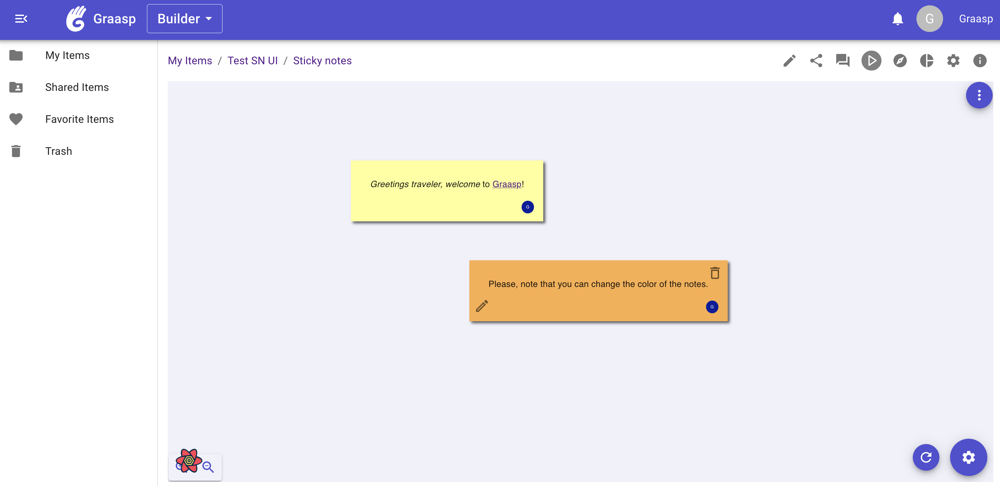
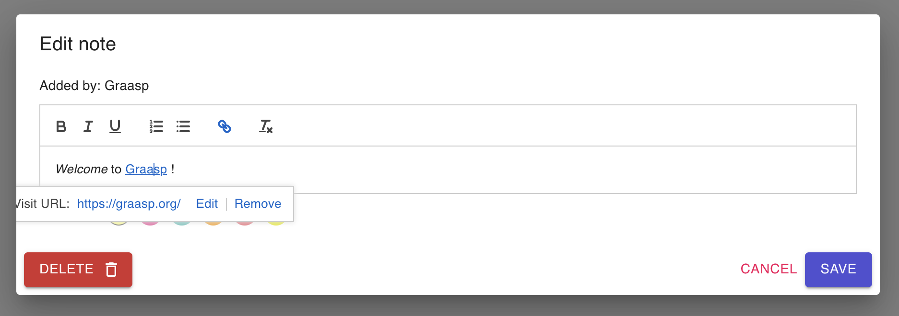

# Sticky Notes app for Graasp

This app is a virtual board on which you can put sticky notes. The sticky notes may contain rich text and links and their color can be changed. Additionaly, the background of the board can be set by the user.

### Rich notes

You can format the text in the notes and add hyperlinks. You can also change the colors of the notes.

### Collaboration

The app can be used collaboratively on Graasp. At the moment, to be able to modify the notes of the other users, all users need *admin* access to the item. The communication is not exactly realtime. Therefore, a refresh button helps you refresh the app to be sure it displays all the sticky notes that have been added.
